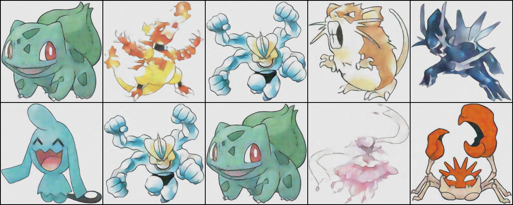

# About this repository

This repository contains the code for one of the most common generative model: Variational Autoencoder (VAE).
The code is implemented in PyTorch and is designed to be modular and easy to understand. The main components of the VAE are separated into different files, making it easy to modify and extend the code.
The data used to train the VAE is the [Pokemon Image](https://www.kaggle.com/datasets/hlrhegemony/pokemon-image-dataset/data) dataset.

There is blog post that explains the code in detail. You can find the blog post [here](https://yyzhang2000.github.io/Blog/projects/VAE.html).

## Get Started

If you already have dataset, you can skip this step.

1. Running the following command to download the dataset and split it into train and test sets. The dataset will be downloaded to the `data` directory. (You need set the `KAGGLE_USERNAME` and `KAGGLE_KEY` environment variables to your Kaggle API credentials. You can export to the environment variables in your terminal or add them to your `.env` file.)

```bash
./prepare_data.sh
```

2. By running the following command, you can start training the VAE model. The model will be trained on the training set and evaluated on the test set. The trained model will be saved to the `logs` directory.

```bash
python train.py
```

Below are some examples of the generated images from the VAE models in different epochs:

- Original images: 
- **Epoch 20**: 
- **Epoch 100**: 
- **Epoch 200**: 
- **Epoch 300**: 
- **Epoch 400**: 
-
